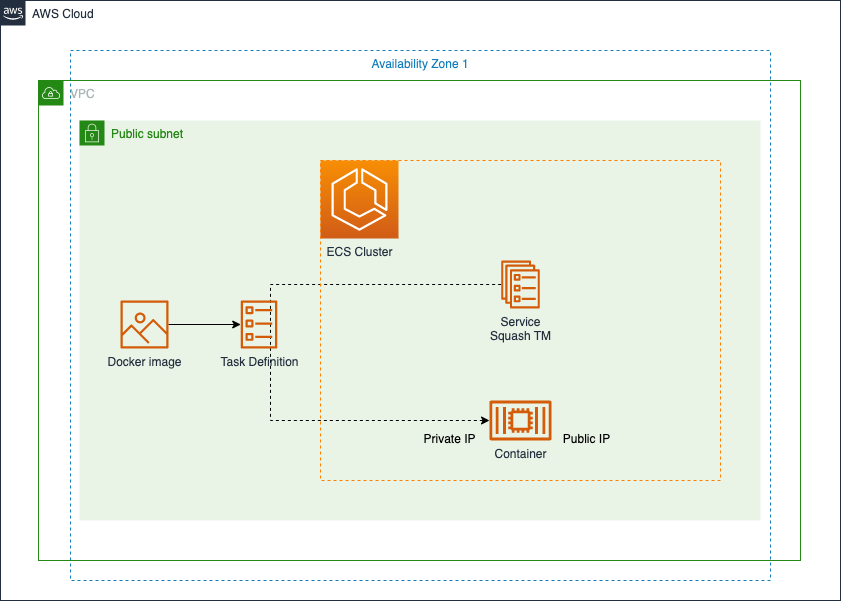

# Squash TM on AWS ECS Fargate using Terraform



This project automates the deployment of Squash TM on Amazon Web Services (AWS). It uses Terraform to describe and configure the resources required to run Squash TM on AWS ECS Fargate.

## Requirements

- AWS CLI v2
- Terraform v0.13 or later.
- aws2-wrap to facilitate exporting the current AWS SSO credentials or runing a command with them
- An AWS account with sufficient permissions to create the resources defined in the Terraform main.

## Key Components

This Terraform module deploys the following components on AWS:

- VPC: A virtual private cloud (VPC) that provides isolated network space for Squash TM.
- ECS Cluster: An Amazon Elastic Container Service (ECS) cluster that manages the deployment and scaling of Squash TM.
- Security Group: A security group that controls access to Squash TM. The security group allows incoming traffic on port 8080.
- ECS Task Definition: An ECS task definition that specifies the resources to be used by Squash TM, including CPU, memory, and the Docker image to run.
- ECS Service: An ECS service that manages the deployment and scaling of the Squash TM tasks.
- IAM Role: An AWS Identity and Access Management (IAM) role that provides permissions for the Squash TM tasks to interact with other AWS services.
- IAM Role Policy Attachment: An IAM policy attachment that associates the IAM role with the necessary permissions.

These components work together to create a fully functional Squash TM demo on AWS ECS using the Fargate launch type.

## Configuration

The Terraform `main.tf` can be configured by modifying the values in the following variables:

- region: The AWS region where the resources will be deployed.
- name: The name to be used for the VPC, ECS cluster, and other resources.
- cidr: The CIDR block to be used for the VPC.
- azs: The availability zones to be used for the VPC public subnets.
- public_subnets: The CIDR blocks to be used for the VPC public subnets.

## Usage

1. Clone this repository:

``` bash
git clone https://github.com/Yris-ops/Squash-TM-AWS-ECS-Fargate.git
cd Squash-TM-AWS-ECS-Fargate
```

2. Initialize Terraform and download the required providers:
``` bash
aws2-wrap --profile <aws_profile> terraform init
```

3. Create an execution plan:

``` bash
aws2-wrap --profile <aws_profile> terraform plan
```

4. Apply the Terraform configuration:

``` bash
aws2-wrap --profile <aws_profile> terraform apply
```

## Access Squash TM

1. Connect to the Squash TM using the public IP address of the ECS task and port 8080.
	1. You can easily grab your new Squash TM endpoint navigating to the AWS ECS console.
	1. Navigate to the Tasks tab to see the `squash-tm` task. Drill into the task to see the public IP.
	1. Please allow a few minutes for the applicaton to start. Go to http://<public_IP>:8080/squash and Enjoy.

## Note

For more information about Squash TM, visit [Squashtest Squash TM](https://hub.docker.com/r/squashtest/squash-tm)

## Clean 

To remove the resources created by this Terraform `main.tf`, run the following command:

``` bash
aws2-wrap --profile <aws_profile> terraform destroy
```

## Security

See [CONTRIBUTING](CONTRIBUTING.md#security-issue-notifications) for more information.

## License

This library is licensed under the MIT-0 License. See the LICENSE file.
